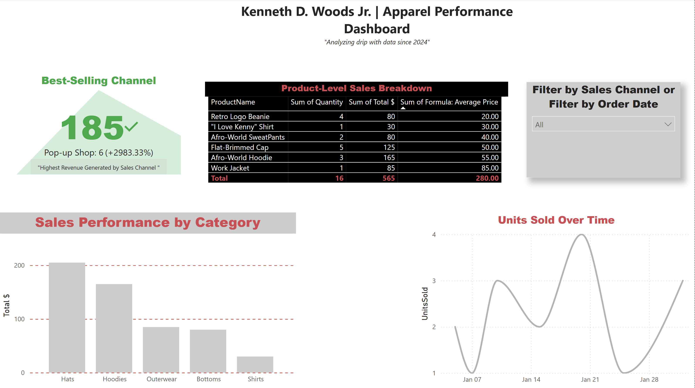

# My Clothing Brand Sales Power BI Dashboard

## 📁 Download the Power BI File

You can download the full `.pbix` file here to explore the report interactively:

👉 [Click to Download the PBIX File](ClothingBrandDashboard.pbix)

A Power BI project visualizing sales and product performance for a personal apparel brand. Built to explore how data storytelling can support better business strategy.

## 📊 Key Features
- KPI tracker for Total Sales and Product Count
- Monthly sales trend line chart
- Product category comparison bar chart
- Clean, single-page layout for fast insights

## 🛠 Tools & Skills
- Power BI Desktop
- Excel for data prep
- DAX (basic)
- Data visualization & storytelling

## 🧠 Why I Built This
As a transitioning Navy veteran, I wanted to explore data analytics using a topic I care about. This dashboard helped me understand how clear visuals drive better decisions — both in business and in my career shift.

## 📁 Files
- `ClothingBrandDashboard.pbix` – Power BI file
- `sales_data.csv` – Raw sales data
- `Dashboard_Screenshot.png` – Project preview

## 🔗 Connect With Me
- [LinkedIn](https://linkedin.com/in/kennethwoodsjr98)
